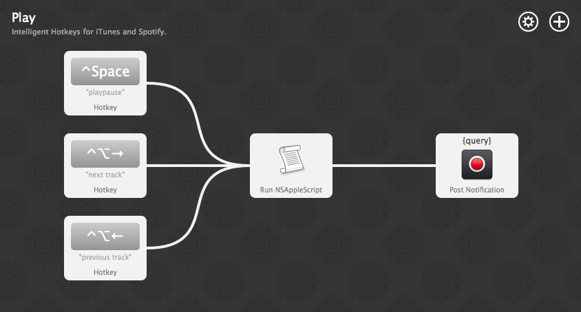

# Play for Alfred

> Intelligent global hotkeys for iTunes and Spotify.

Control iTunes and Spotify using the **same global hotkeys** with this Alfred workflow. *Play* magically knows which player you're currently using and **sends the command to the right place**.

[Download](Play.alfredworkflow?raw=true)

## Configuration

After installing *Play*,  choose the hotkeys you'd like to use.

### Example

| Action          | Hotkey            |
| --------------- | ----------------- |
| Play/Pause      | `Ctrl + Space`    |
| Next Track      | `Ctrl + Alt + →`  |
| Previous Track  | `Ctrl + Alt + ←`  |

